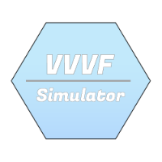

# VVVF-Simulator-Core
Unofficial port of VVVF Simulator core functions.

## Build
### Pre-build

### Build from source

## Documentation
See [documentation.md](documentation.md) for usage.
## Contributions
Contributions to this [project](https://github.com/Deiloproxide/VVVF-Simulator-Core) are welcome. 
Please feel free to report issues, make comments, or submit a pull request.
## Thanks
Thanks to the creators of following projects! 

## Contact us
